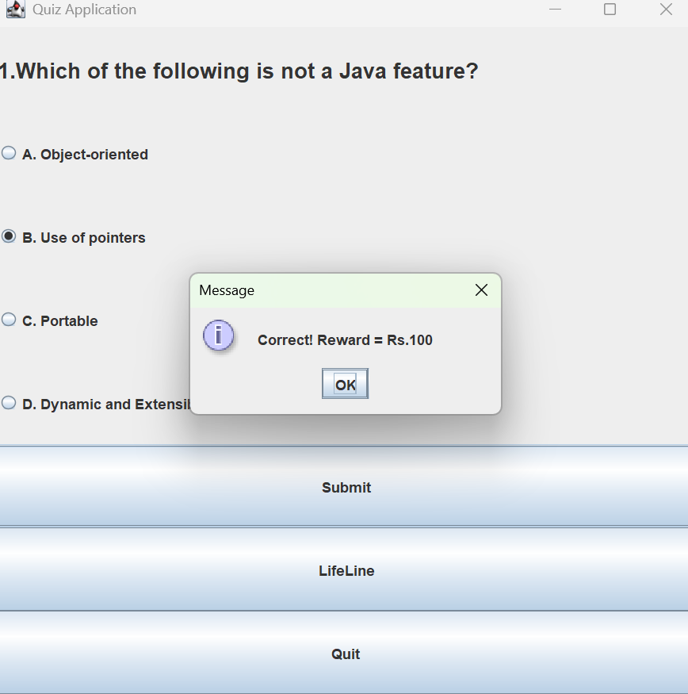
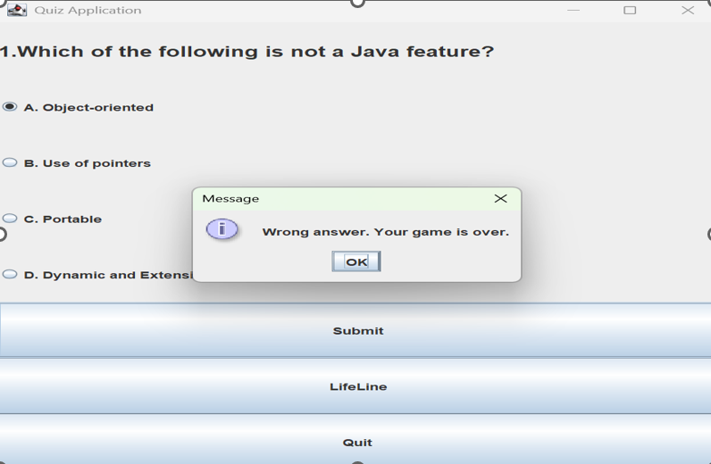

# Swing-Quiz-Application

## Project Overview
A desktop-based Quiz Application developed using Java Swing that allows users to answer multiple-choice questions with lifelines, rewards, and safe zones.
### Topics
java
java-swing
quiz-application
desktop-application
gui
java-project

## 📸 Screenshots

### Correct Answer

### Wrong Answer

### Use of All Lifelines

### Skip Lifeline

### Phone Call Lifeline

### Audience Poll Lifeline

### Final Output

### Quitting the Game

